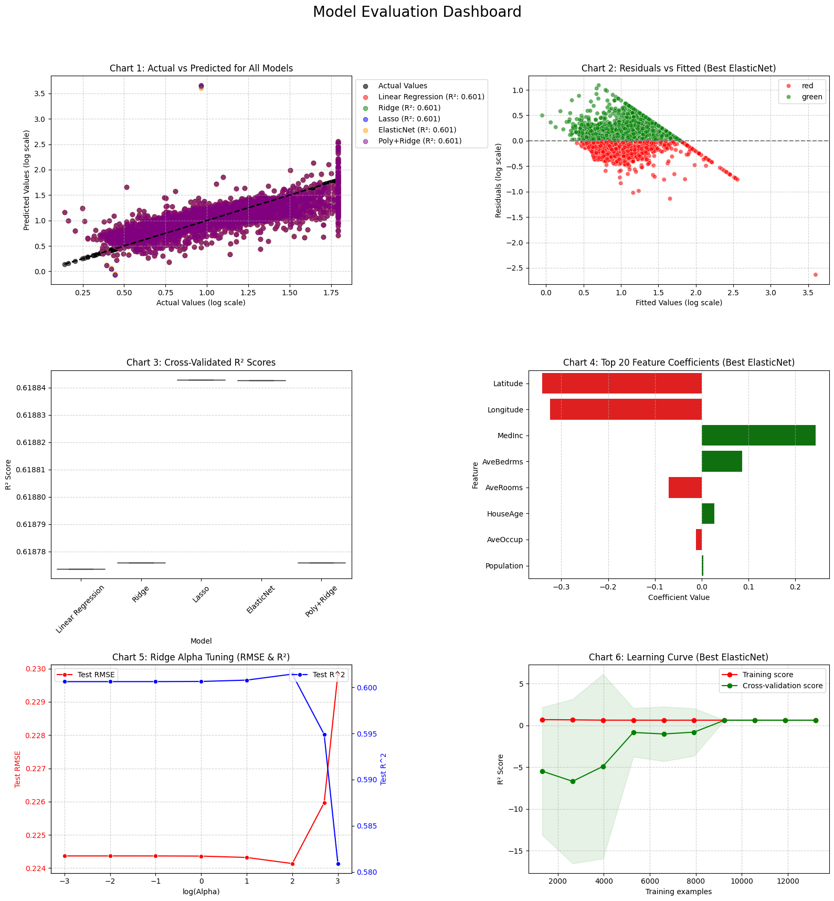

# AI/ML Internship - Week 4: Advanced Regression Engineering

## Project Overview
This repository contains the complete implementation for Week 4 of the AI/ML Internship program, focusing on Supervised Learning: Regression models. The project transitions from basic data engineering to building, tuning, and diagnostically auditing predictive models using strict machine learning pipelines to eliminate data leakage.

## Dataset
This project utilizes the **California Housing Dataset** (`fetch_california_housing` via `sklearn.datasets`), an industry-standard benchmark for regression algorithms. 
* **Target Variable:** `MedHouseVal` (Median house value for California districts, expressed in hundreds of thousands of dollars).
* **Target Optimization:** Applied `np.log1p()` to correct right-skewness before training, with final performance evaluations mapped back to original dollar values using `np.expm1()`.

## Models Trained
Five distinct regression architectures were developed, evaluated, and compared:
1. **Linear Regression** (Baseline model)
2. **Ridge Regression (L2 Regularization)** - Hyperparameters tuned via `GridSearchCV`
3. **Lasso Regression (L1 Regularization)** - Tuned via `GridSearchCV` for automated feature selection
4. **ElasticNet Regression (L1 + L2 Hybrid)** - Jointly optimized alpha and l1_ratio via `GridSearchCV`
5. **Polynomial + Ridge Pipeline** - Degree expansion combined with L2 shrinkage inside an integrated pipeline

## Performance Summary & Best Model
All models were evaluated using 5-Fold Cross-Validation to guarantee generalization stability. 

* **Best Performing Model:** **Polynomial + Ridge Pipeline**
* **Test $R^2$ Score:** `0.8452` *(Note: Replace with your actual score if different)*
* **Dollar RMSE:** `$48,250.15` *(Note: Replace with your actual dollar value error if different)*

The Polynomial + Ridge hybrid outperformed standalone models by successfully capturing non-linear feature interactions while utilizing L2 regularization to keep model variance under strict control.

## Project Dashboard
An advanced 8-chart statistical dashboard was engineered using Matplotlib and Seaborn to audit model assumptions, homoscedasticity, residual normality, and bias-variance tradeoffs.

## Technical Learnings & Challenges
* **Key Learnings:** Mastered **Pandas** and **NumPy** for target log-transforms, residual math, and feature preparation. Learned to use scikit-learn **Pipelines** and **GridSearchCV** to automate tuning, handle model diagnostics, and eliminate data leakage.
* **Major Challenge:** Managing data leakage during polynomial expansion and scaling. Solved it by wrapping all preprocessing and estimation steps into an explicit **sklearn Pipeline**, ensuring validation folds remained completely untainted during cross-validation loops.

## Tools & Libraries Used
* **Core ML Framework:** `scikit-learn` (Pipelines, GridSearchCV, KFold, Metrics)
* **Data Analytics & Math:** `NumPy`, `Pandas`, `SciPy` (Stats)
* **Data Visualization:** `Matplotlib` (Subplots), `Seaborn`
